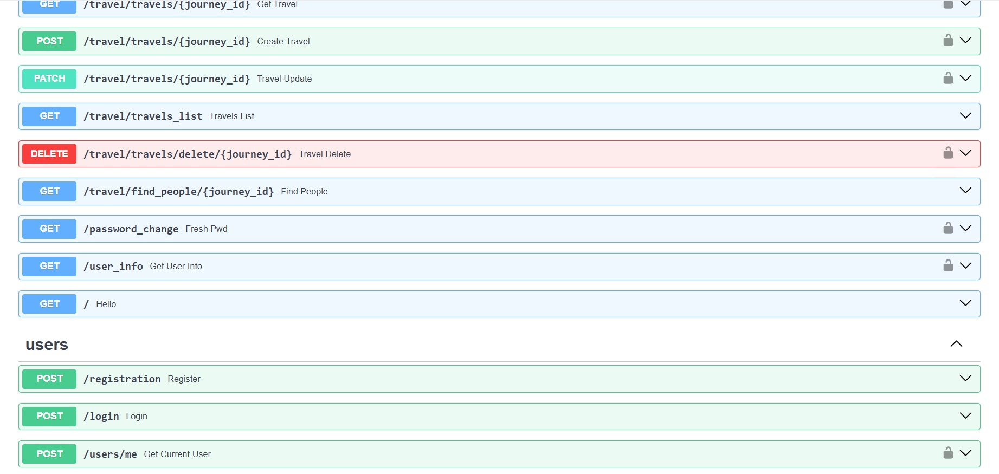

# Лабораторная работа №1

Научиться реализовывать полноценное серверное приложение с помощью фреймворка FastAPI с применением дополнительных средств и библиотек.
Задача - создать веб-приложение, которое позволит пользователям обмениваться книгами между собой. Это приложение должно облегчать процесс обмена книгами, позволяя пользователям находить книги, которые им интересны, и находить новых пользователей для обмена книгами. Функционал веб-приложения должен включать следующее:
Создание профилей: Возможность пользователям создавать профили, указывать информацию о себе, своих навыках, опыте работы и предпочтениях по проектам.
Добавление книг в библиотеку: Пользователи могут добавлять книги, которыми они готовы поделиться, в свою виртуальную библиотеку на платформе.
Поиск и запросы на обмен: Функционал поиска книг в библиотеке других пользователей. Возможность отправлять запросы на обмен книгами другим пользователям.
Управление запросами и обменами: Возможность просмотра и управления запросами на обмен. Возможность подтверждения или отклонения запросов на обмен.

## Ход выполнения работы

### main.py:
    import uvicorn
    from fastapi import FastAPI
    from sqlmodel import SQLModel
    
    from db.db import engine
    from endpoints.user_endpoints import user_router
    from endpoints.money_endpoints import main_router
    from models.user_models import *
    
    app = FastAPI()
    
    app.include_router(user_router)
    app.include_router(main_router, prefix="/api")
    
    
    def create_db():
        SQLModel.metadata.create_all(engine)
    
    
    @app.on_event("startup")
    def on_startup():
        create_db()
    
    
    if __name__ == '__main__':
        uvicorn.run(app, host='localhost', port=8001)

### auth.py:
    import datetime
    
    from fastapi import Security, HTTPException
    from fastapi.security import HTTPBearer, HTTPAuthorizationCredentials
    from passlib.context import CryptContext
    import jwt
    from sqlmodel import Session, select
    from starlette import status
    from dotenv import load_dotenv
    
    
    import os
    
    from db.db import engine
    from models.user_models import User
    
    load_dotenv()
    
    secret_key = os.getenv("SECRET_KEY")
    
    def find_user(name):
        with Session(engine) as session:
            statement = select(User).where(User.username == name)
            return session.exec(statement).first()
    
    class AuthHandler:
        security = HTTPBearer()
        pwd_context = CryptContext(schemes=['bcrypt'])
        secret = secret_key
    
        def get_password_hash(self, password):
            return self.pwd_context.hash(password)
    
        def verify_password(self, pwd, hashed_pwd):
            return self.pwd_context.verify(pwd, hashed_pwd)
    
        def encode_token(self, user_id):
            payload = {
                'exp': datetime.datetime.utcnow() + datetime.timedelta(hours=8),
                'iat': datetime.datetime.utcnow(),
                'sub': user_id
            }
            return jwt.encode(payload, self.secret, algorithm='HS256')
    
        def decode_token(self, token):
            try:
                payload = jwt.decode(token, self.secret, algorithms=['HS256'])
                return payload['sub']
            except jwt.ExpiredSignatureError:
                raise HTTPException(status_code=401, detail='Expired signature')
            except jwt.InvalidTokenError:
                raise HTTPException(status_code=401, detail='Invalid token')
    
        def auth_wrapper(self, auth: HTTPAuthorizationCredentials = Security(security)):
            return self.decode_token(auth.credentials)
    
        def get_current_user(self, auth: HTTPAuthorizationCredentials = Security(security)):
            credentials_exception = HTTPException(
                status_code=status.HTTP_401_UNAUTHORIZED,
                detail='Could not validate credentials'
            )
            username = self.decode_token(auth.credentials)
            if username is None:
                raise credentials_exception
            user = find_user(username)
            if username is None:
                raise credentials_exception
            return user
### money_endpoints.py
    from fastapi import APIRouter, HTTPException, Depends
    from typing import List
    
    from sqlmodel import Session
    
    from endpoints.user_endpoints import auth_handler
    from models.money_models import Balance, Target, Transactions, TargetCreate, TargetUpdate, TransactionsCreate, Category, \
        TransactionsUpdate, UserBalance, TargetResponse
    from db.db import session
    
    main_router = APIRouter()
    
    
    @main_router.get("/balances/{balance_id}", response_model=UserBalance)
    def get_balance(balance_id: int):
        balance = session.get(Balance, balance_id)
        if not balance:
            raise HTTPException(status_code=404, detail="Balance not found")
        return balance
    
    
    @main_router.post("/balances/{balance_id}/targets/", response_model=Target)
    def create_target_for_balance(balance_id: int, target: TargetCreate, user=Depends(auth_handler.auth_wrapper)):
        db_balance = session.get(Balance, balance_id)
        if db_balance is None:
            raise HTTPException(status_code=404, detail="Balance not found")
        if target.category not in Category:
            raise HTTPException(status_code=400, detail="Invalid category")
        db_target = Target(**target.dict(), balance_id=balance_id)
        session.add(db_target)
        session.commit()
        session.refresh(db_target)
        return db_target
    
    
    @main_router.put("/balances/{balance_id}/targets/{target_id}", response_model=Target)
    def update_target_for_balance(balance_id: int, target_id: int, target: TargetUpdate, user=Depends(auth_handler.auth_wrapper)):
        db_target = session.get(Target, target_id)
        if db_target is None:
            raise HTTPException(status_code=404, detail="Target not found")
        if target.category not in Category:
            raise HTTPException(status_code=400, detail="Invalid category")
        for key, value in target.dict(exclude_unset=True).items():
            setattr(db_target, key, value)
        session.add(db_target)
        session.commit()
        session.refresh(db_target)
        return db_target
    
    
    @main_router.delete("/balances/{balance_id}/targets/{target_id}")
    def delete_target_for_balance(balance_id: int, target_id: int, user=Depends(auth_handler.auth_wrapper)):
        db_target = session.get(Target, target_id)
        if db_target is None:
            raise HTTPException(status_code=404, detail="Target not found")
        session.delete(db_target)
        session.commit()
        return {"message": "Target deleted"}
    
    
    @main_router.get("/balances/{balance_id}/targets/", response_model=List[TargetResponse])
    def get_targets_for_balance(balance_id: int):
        targets = session.query(Target).filter(Target.balance_id == balance_id).all()
        if not targets:
            raise HTTPException(status_code=404, detail="Targets not found for this balance")
        return targets
    
    
    @main_router.post("/balances/{balance_id}/transactions/", response_model=Transactions)
    def create_transaction_for_balance(balance_id: int, transaction: TransactionsCreate, user=Depends(auth_handler.auth_wrapper)):
        db_balance = session.get(Balance, balance_id)
        if db_balance is None:
            raise HTTPException(status_code=404, detail="Balance not found")
        if transaction.category not in Category:
            raise HTTPException(status_code=400, detail="Invalid category")
        db_transaction = Transactions(**transaction.dict(), balance_id=balance_id)
        session.add(db_transaction)
        session.commit()
        session.refresh(db_transaction)
        return db_transaction
    
    
    @main_router.put("/transactions/{transaction_id}", response_model=Transactions)
    def update_transaction(transaction_id: int, transaction: TransactionsUpdate, user=Depends(auth_handler.auth_wrapper)):
        db_transaction = session.get(Transactions, transaction_id)
        if db_transaction is None:
            raise HTTPException(status_code=404, detail="Transaction not found")
        if transaction.category not in Category:
            raise HTTPException(status_code=400, detail="Invalid category")
        for key, value in transaction.dict(exclude_unset=True).items():
            setattr(db_transaction, key, value)
    
        session.add(db_transaction)
        session.commit()
        session.refresh(db_transaction)
    
        return db_transaction
    
    
    @main_router.delete("/balances/{balance_id}/transactions/{transaction_id}")
    def delete_transaction_for_balance(balance_id: int, transaction_id: int, user=Depends(auth_handler.auth_wrapper)):
        db_transaction = session.get(Transactions, transaction_id)
        if db_transaction is None:
            raise HTTPException(status_code=404, detail="Transaction not found")
        session.delete(db_transaction)
        session.commit()
        return {"message": "Transaction deleted"}
    
    
    @main_router.get("/balances/{balance_id}/transactions/", response_model=List[Transactions])
    def get_transactions_for_balance(balance_id: int):
        db_balance = session.get(Balance, balance_id)
        if db_balance is None:
            raise HTTPException(status_code=404, detail="Balance not found")
        return db_balance.transactions

### user_endpoints.py
    from fastapi import APIRouter, HTTPException, Depends
    from sqlmodel import Session, select
    from starlette.responses import JSONResponse
    from starlette.status import HTTP_201_CREATED
    
    from auth.auth import AuthHandler
    from models.money_models import Balance
    from models.user_models import UserInput, User, UserLogin
    from db.db import session, engine
    
    user_router = APIRouter()
    auth_handler = AuthHandler()
    
    def find_user(name):
        with Session(engine) as session:
            statement = select(User).where(User.username == name)
            return session.exec(statement).first()
    
    def select_all_users():
        with Session(engine) as session:
            statement = select(User)
            res = session.exec(statement).all()
            return res
    
    @user_router.post('/registration', status_code=201, tags=['users'], description='Register new user')
    def register(user: UserInput):
        users = select_all_users()
        if any(x.username == user.username for x in users):
            raise HTTPException(status_code=400, detail='Username is taken')
        hashed_pwd = auth_handler.get_password_hash(user.password)
        balance = Balance(balance=0)
        u = User(username=user.username, password=hashed_pwd, email=user.email, balance=balance)
        session.add_all([u, balance])
        session.commit()
    
        return JSONResponse(status_code=201, content={"message": "User registered successfully"})
    
    
    @user_router.post('/login', tags=['users'])
    def login(user: UserLogin):
        user_found = find_user(user.username)
    
        if not user_found:
            raise HTTPException(status_code=401, detail='Invalid username and/or password')
        verified = auth_handler.verify_password(user.password, user_found.password)
    
        if not verified:
            raise HTTPException(status_code=401, detail='Invalid username and/or password')
    
        token = auth_handler.encode_token(user_found.username)
        return {'token': token}
    
    
    @user_router.post('/users/me', tags=['users'])
    def get_current_user(user: User = Depends(auth_handler.get_current_user)):
        return user.username

### money_models.py:
    from enum import Enum
    
    from sqlmodel import SQLModel, Field, Relationship
    from typing import Optional, List
    
    from models.user_models import User
    
    
    class Category(str, Enum):
        FOOD = "Food"
        TRANSPORTATION = "Transportation"
        ENTERTAINMENT = "Entertainment"
        SHOPPING = "Shopping"
        BILLS = "Bills"
        SALARY = "Salary"
        SAVINGS = "Savings"
        OTHER = "Other"
    
    
    class TransactionsType(str, Enum):
        INCOME = "income"
        EXPENSES = "expenses"
    
    
    class TargetDeafult(SQLModel):
        category: Category = Category.OTHER
        value: int = 0
        balance_id: int = Field(foreign_key="balance.id")
    class Target(TargetDeafult, table=True):
        id: int = Field(primary_key=True)
        balance: Optional["Balance"] = Relationship(back_populates="targets")
    
    class Transactions(SQLModel, table=True):
        id: int = Field(primary_key=True)
        category: Category = Category.OTHER
        value: int = 0
        type: TransactionsType = TransactionsType.INCOME
        balance_id: int = Field(foreign_key="balance.id")
        balance: Optional["Balance"] = Relationship(back_populates="transactions")
    
    class BalanceDeafult(SQLModel):
        balance: int = 0
        user_id: Optional[int] = Field(foreign_key="user.id")
    
    class Balance(BalanceDeafult, table=True):
        id: int = Field(primary_key=True)
        user: Optional[User] = Relationship(back_populates="balance")
        transactions: List[Transactions] = Relationship(back_populates="balance")
        targets: List[Target] = Relationship(back_populates="balance")
    
    
    class UserBalance(BalanceDeafult):
        transactions: List[Transactions] = None
        targets: List[Target] = None
    
    
    class TargetResponse(TargetDeafult):
        balance: Optional[Balance] = None
    
    class TargetCreate(SQLModel):
        category: Category
        value: int
    
    
    class TargetUpdate(SQLModel):
        category: Category
        value: int
    
    
    class TransactionsCreate(SQLModel):
        category: Category
        type: TransactionsType
        value: int
    
    
    class TransactionsUpdate(SQLModel):
        category: Category
        type: TransactionsType
        value: int

### user_models.py:
    import datetime
    from enum import Enum
    from typing import Optional, List
    
    from pydantic import validator
    from sqlmodel import SQLModel, Field, Relationship
    
    
    class User(SQLModel, table=True):
        id: int = Field(primary_key=True)
        username: str = Field(index=True)
        password: str
        email: str
        balance: Optional["Balance"] = Relationship(back_populates="user")
        created_at: datetime.datetime = Field(default=datetime.datetime.now())
    
    
    class UserInput(SQLModel):
        username: str
        password: str
        password2: str
        email: str
    
        @validator('password2')
        def password_match(cls, v, values, **kwargs):
            if 'password' in values and v != values['password']:
                raise ValueError('passwords don\'t match')
            return v
    
    
    class UserLogin(SQLModel):
        username: str
        password: str

### db.py
    from sqlmodel import create_engine, Session
    import os
    from dotenv import load_dotenv
    
    load_dotenv()
    postgres_url = os.getenv('DB_URL')
    
    db_url = postgres_url
    engine = create_engine(db_url, echo=True)
    session = Session(bind=engine)
## Результат

